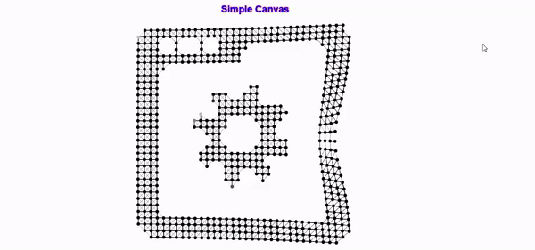

# Canvas and Fancy Button

This is an canvas logo by using javascript and Fancy Button by using CSS3. 


## Screenshots
*Watch Demo video [here](./sr.demo.mp4).*  
  


## Requirements
All Browser.
Safari, Chrome, Firefox, Opre and IE

##  How to use canvas
1) look at javascirpt file and paste as your custom image code **js.js**.
```// Load initial input image (past your own image code here!)
    this.loadData( 'data:image/jpeg;base64,...')
```  

2) Convert Your iMage To 64 Bit Data   
```https://www.base64-image.de/
```  
you can convert your image from the above link. After that copy all code and paste at the step 1.

3) Finish.  
 Save and look at from your browser. I'm sure that you can see your own image with canvas action.

##  How to use Fancy Button 
1) look at Css file at Css Folder **stylesheet.css**.
```#box1{
    background: linear-gradient(to bottom left, #fc3, #f91);
    width: 360px;
    height: 80px;
    margin: 0 0 30px;
    text-align: center;
    line-height: 80px;
    color: aliceblue;
    font-weight: 700;
    -webkit-border-radius: 40px;
     -moz-border-radius: 40px;
     -o-border-radius: 40px;
     border-radius: 40px;    
}
#box1:hover{
    background: linear-gradient(to bottom left, #f91, #fc3);
    -webkit-box-shadow: 2px 1px 3px #000;
    -moz-box-shadow: 2px 1px 3px #000;
    -o-box-shadow: 2px 1px 3px #000;
    box-shadow: 2px 1px 3px #000;
    text-shadow: 0 0 5px #000;
    
}
```  
Yon can change to your own color.

2) In HTML ***index.html***.  
```<div id="box1">Button</div>
        <div id="box2">Button</div>
        <div id="box3">Button</div>
        <div id="box4">Button</div>
```  
In your html file, call style with id name. 

3) Finish.  
 Save and look at from your browser. I'm sure that you can see your own button.


## License

    Copyright 2017 Sai Tawng Pha

    Licensed under the Apache License, Version 2.0 (the "License");
    you may not use this file except in compliance with the License.
    You may obtain a copy of the License at

       http://www.apache.org/licenses/LICENSE-2.0

    Unless required by applicable law or agreed to in writing, software
    distributed under the License is distributed on an "AS IS" BASIS,
    WITHOUT WARRANTIES OR CONDITIONS OF ANY KIND, either express or implied.
    See the License for the specific language governing permissions and
    limitations under the License.
